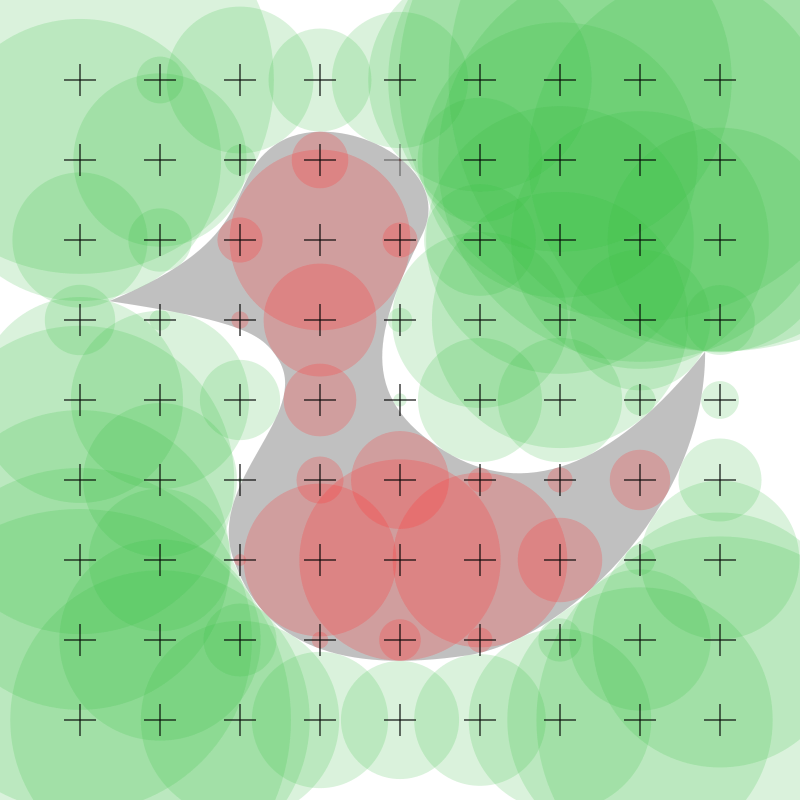
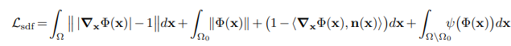
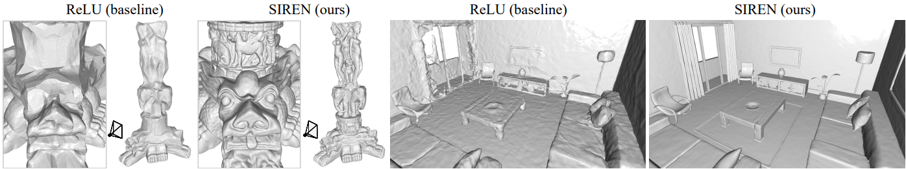
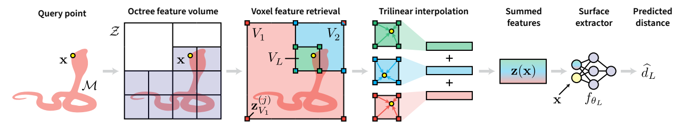
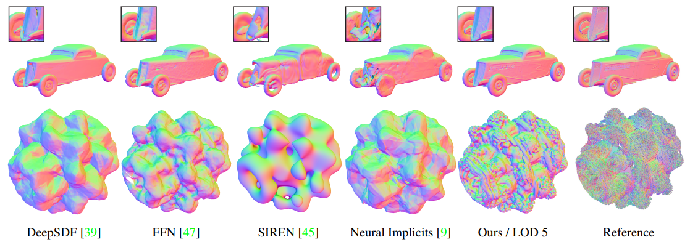
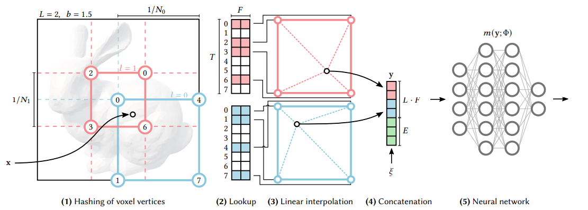
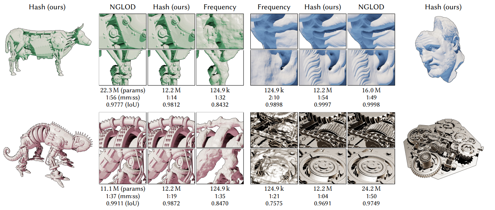
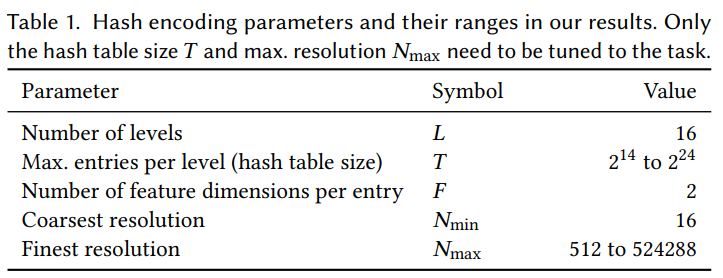

# Implicit SDF representation: Report

## Abstract

The main goal of this task is to compress meshes by representing them as SDFs (Signed Distance Functions). For this purpose, different approaches such as SIREN, NG-LOD and INGP are compared. Original Instant-NGP implementation is modified in order to achieve small network size and later is used to compress different 3D objects into lightweight SDF neural network.

## Introduction

### SDF (Signed Distance Function)

SDF is such a function that takes some point in the 3D space as input and returns the distance from that point to the surface of the object.
Therefore, if the given point is inside the object SDF is positive, 0 if it is on the boundary and negative if it is outside the object (See the picture below).



Using SDF we can describe objects with much less memory consumption and with infinite resolution. For example it is impossible to represent a sphere as a set of triangles, but it is very easy to represent with SDF ```r^2 - x^2 - y^2 - z^2```.

### Neural network usage

When the object is represented not as SDF, there is a need to construct it somehow.

The simple and the most naive approach is to store SDF values for the grid points and later interpolate between them. The major outback is that we are losing both memory consumption and resolution in this case.

Advanced approaches require constructing a special neural network that is trained on the sample points. 

## Related work

### SIREN

ReLU-based multilayer perceptrons (MLPs) lack the capacity to represent fine details in the
underlying signals, and they typically do not represent the derivatives of a target signal well. This
is partly due to the fact that ReLU networks are piecewise linear, their second derivative is zero
everywhere, and they are thus incapable of modeling information contained in higher-order derivatives
of natural signals.<sup>[1]</sup>

SIREN (**SI**nusoidal **RE**presentation **N**etworks) introduce periodic activation functions (`sin` is used in the original paper, but can be any other) instead of standard ReLU.

SIREN is trained only on oriented point clouds (only on the gradient without an actual distance).
Fitting SIREN is done using a loss of the form (see below<sup>[1]</sup>)



During training, each minibatch contains an equal number of points on and off the mesh, each one randomly sampled over the sample space. As seen in the picture below<sup>[1]</sup>, the proposed periodic
activations significantly increase the details of objects.



### NG-LOD

**N**eural **G**eometric **L**evel **O**f **D**etail (NG-LOD) represents implicit surfaces using an octree-based feature volume which adaptively fits shapes with multiple discrete levels of detail (LODs), and enables continuous LOD with SDF interpolation.<sup>[2]</sup>



As shown in the picture above<sup>[2]</sup>, NG-LOD encodes neural SDF using a **S**parse **V**oxel **O**ctree (SVO) which holds a collection of features. The levels of the SVO define LODs and the voxel corners contain feature vectors defining local surface segments. Given query point x and LOD L, we
find corresponding voxels, trilinearly interpolate their corners and sum to obtain a feature vector. Together with input point, this vector is fed into a small MLP to obtain a signed distance.

This method allows to capture the high-frequency details to reasonable accuracy (see below<sup>[2]</sup>).



### Instant-NGP *(chosen)*

NGPs that are parameterized by fully connected neural networks can be costly to train and evaluate.
Thus, to reduce this cost Instant-NGP introduces a versatile multiresolution hash encoding that permits the use of a smaller network without sacrificing quality, thus significantly reducing the number of floating point and memory access operations. A small neural network is augmented by a multiresolution hash table of trainable feature vectors whose values are optimized through stochastic gradient descent.<sup>[3]</sup>



The picture above is the illustration of the multiresolution hash encoding in 2D. For a given input coordinate x, we find the surrounding voxels at L resolution levels and
assign indices to their corners by hashing their integer coordinates. For all resulting corner indices, we look up the corresponding F-dimensional feature
vectors from the hash tables and linearly interpolate them according to the relative position of x within the respective l-th voxel. Then, we concatenate the
result of each level, as well as auxiliary inputs, producing the encoded MLP input, which is evaluated last. To train the encoding, loss
gradients are backpropagated through the MLP, the concatenation, the linear interpolation, and then accumulated in the looked-up feature vectors.<sup>[3]</sup>



Nevertheless, NGLOD achieves the highest visual reconstruction quality as seen in the picture above<sup>[3]</sup>. However, INGP encoding
approaches a similar fidelity to NGLOD in terms of the **I**ntersection-**o**ver-**U**nion metric (IoU) with similar performance and memory cost.
Furthermore, the SDF is defined everywhere within the training volume,
as opposed to NGLOD, which is only defined within the octree (i.e. close to the surface). This permits the use of certain SDF rendering techniques
such as approximate soft shadows from a small number of off-surface distance samples.

Thus, Instant-NGP approach is chosen for the task.

## Implementation details

In order to make the network both lightweight and high-quality some hash encoder are fine-tuned.

In the picture below<sup>[3]</sup>, the default encoder parameters are presented. In order to satisfy the requirements, the number of levels is set to 8, max entries per level (hash table size) is set to 2<sup>18</sup>, coarsest resolution is set to 8 and finest resolution is set to 32.



## Evaluation

### Quality measurement

Quality is measured as F1 score between the true SDF sign and predicted SDF sign of sampled points

* For measurement on the surface points are almost equally distributed on a surface + Gaussian noise with stdev `1e-2`
* For measurement on the bounding volume of the object points are randomly selected from the volume 

### Results

```text
+--------------+-----------------+-------------------+------------------+--------------------------+---------------------+
| Model number | Model size (MB) | Quality (surface) | Quality (volume) | Time per 100k batch (ms) | Time per point (ns) |
+--------------+-----------------+-------------------+------------------+--------------------------+---------------------+
| 0            | 0.6528          | 0.7614            | 0.9973           | 0.2410                   | 2.4102              |
| 1            | 0.6528          | 0.9668            | 0.9994           | 0.4327                   | 4.3271              |
| 2            | 0.6528          | 0.9817            | 1.0000           | 0.3524                   | 3.5243              |
| 3            | 0.6528          | 0.9872            | 0.9998           | 0.2252                   | 2.2516              |
| 4            | 0.6528          | 0.9390            | 0.9989           | 0.2595                   | 2.5954              |
| 5            | 0.6528          | 0.8733            | 0.9985           | 0.4533                   | 4.5331              |
| 6            | 0.6528          | 0.9283            | 1.0000           | 0.2781                   | 2.7807              |
| 7            | 0.6528          | 0.8885            | 0.9984           | 0.2527                   | 2.5272              |
| 8            | 0.6528          | 0.9044            | 0.9997           | 0.2670                   | 2.6696              |
| 9            | 0.6528          | 0.9627            | 0.9994           | 0.2268                   | 2.2681              |
| 10           | 0.6528          | 0.9654            | 0.9972           | 0.2507                   | 2.5072              |
| 11           | 0.6528          | 0.9638            | 0.9990           | 0.2223                   | 2.2235              |
| 12           | 0.6528          | 0.9907            | 0.9996           | 0.3138                   | 3.1376              |
| 13           | 0.6528          | 0.8740            | 0.9986           | 0.3210                   | 3.2098              |
| 14           | 0.6528          | 0.9346            | 0.9998           | 0.2227                   | 2.2268              |
| 15           | 0.6528          | 0.8962            | 0.9939           | 0.4359                   | 4.3585              |
| 16           | 0.6528          | 0.8004            | 0.9945           | 0.3892                   | 3.8922              |
| 17           | 0.6528          | 0.8235            | 0.9982           | 0.2772                   | 2.7719              |
| 18           | 0.6528          | 0.8163            | 0.9941           | 0.2268                   | 2.2676              |
| 19           | 0.6528          | 0.8766            | 0.9988           | 0.2347                   | 2.3468              |
| 20           | 0.6528          | 0.7896            | 0.9954           | 0.5000                   | 4.9999              |
| 21           | 0.6528          | 0.9708            | 0.9993           | 0.2248                   | 2.2478              |
| 22           | 0.6528          | 0.9699            | 0.9996           | 0.4853                   | 4.8535              |
| 23           | 0.6528          | 0.9541            | 0.9996           | 0.2450                   | 2.4502              |
| 24           | 0.6528          | 0.9920            | 0.9993           | 0.2391                   | 2.3911              |
| 25           | 0.6528          | 0.9317            | 0.9999           | 0.2256                   | 2.2564              |
| 26           | 0.6528          | 0.8822            | 0.9945           | 0.3914                   | 3.9144              |
| 27           | 0.6528          | 0.8777            | 0.9985           | 0.2245                   | 2.2452              |
| 28           | 0.6528          | 0.9051            | 0.9988           | 0.2299                   | 2.2991              |
| 29           | 0.6528          | 0.9753            | 0.9992           | 0.4349                   | 4.3495              |
| 30           | 0.6528          | 0.9910            | 0.9999           | 0.2471                   | 2.4710              |
| 31           | 0.6528          | 0.9476            | 0.9999           | 0.2429                   | 2.4288              |
| 32           | 0.6528          | 0.9085            | 0.9977           | 0.2229                   | 2.2287              |
| 33           | 0.6528          | 0.9143            | 0.9983           | 0.2245                   | 2.2449              |
| 34           | 0.6528          | 0.9644            | 0.9992           | 0.4680                   | 4.6804              |
| 35           | 0.6528          | 0.9480            | 0.9994           | 0.2213                   | 2.2128              |
| 36           | 0.6528          | 0.8361            | 0.9960           | 0.3069                   | 3.0692              |
| 37           | 0.6528          | 0.9443            | 0.9977           | 0.2532                   | 2.5318              |
| 38           | 0.6528          | 0.9905            | 0.9995           | 0.2388                   | 2.3875              |
| 39           | 0.6528          | 0.8960            | 0.9999           | 0.2660                   | 2.6596              |
| 40           | 0.6528          | 0.9790            | 0.9998           | 0.2632                   | 2.6317              |
| 41           | 0.6528          | 0.9700            | 0.9996           | 0.2480                   | 2.4798              |
| 42           | 0.6528          | 0.9745            | 0.9999           | 0.2319                   | 2.3186              |
| 43           | 0.6528          | 0.9323            | 0.9992           | 0.3093                   | 3.0930              |
| 44           | 0.6528          | 0.9947            | 0.9994           | 0.3933                   | 3.9327              |
| 45           | 0.6528          | 0.9660            | 0.9999           | 0.2384                   | 2.3837              |
| 46           | 0.6528          | 0.7585            | 0.9886           | 0.4843                   | 4.8425              |
| 47           | 0.6528          | 0.9294            | 0.9997           | 0.4351                   | 4.3507              |
| 48           | 0.6528          | 0.9689            | 0.9995           | 0.7041                   | 7.0410              |
| 49           | 0.6528          | 0.9586            | 0.9996           | 0.2874                   | 2.8741              |
+--------------+-----------------+-------------------+------------------+--------------------------+---------------------+
| Average      | 0.6528          | 0.9231            | 0.9984           | 0.3074                   | 3.0740
+--------------+-----------------+-------------------+------------------+--------------------------+---------------------+
```

As shown in the table the results are:
* **The size of the model** is only `0.6528 MB` (< `1 MB`) which satisfies the requirements
* **Average F1 score near the surface** is `0.9231` (> `0.9`) which satisfies the requirements
* **Average F1 score on the bound volume** is `0.9984` (> `0.95`) which satisfies the requirements
* **Average time per 100k batch** is `0.3074 ms` which satisfies the requirements
* **Average time per point** is `3.0740 ns` which satisfies the requirements

## Conclusion

Overall, INGP approach can be used to compress meshes into corresponding lightweight SDF neural networks with a high quality level of details. For instance, in some cases quality `1` on bounding volume is achieved in some cases.
However, for more complex objects, the quality near the surface is relatively low (for example `0.75`). One of the possible reasons is that encoder was too small to fit the whole object complexity.

## References

- [1] - Implicit Neural Representations with Periodic Activation Functions, 2020 - Vincent Sitzmann, Julien N. P. Martel, Alexander W. Bergman, David B. Lindell, Gordon Wetzstein [https://arxiv.org/abs/2006.09661](https://arxiv.org/abs/2006.09661)
- [2] - Neural Geometric Level of Detail: Real-time Rendering with Implicit 3D Shapes, 2021 - Towaki Takikawa, Joey Litalien, Kangxue Yin, Karsten Kreis, Charles Loop, Derek Nowrouzezahrai, Alec Jacobson, Morgan McGuire, Sanja Fidler [https://arxiv.org/abs/2101.10994](https://arxiv.org/abs/2101.10994)
- [3] - Instant Neural Graphics Primitives with a Multiresolution Hash Encoding, 2022 - Thomas Müller, Alex Evans, Christoph Schied, Alexander Keller [https://doi.org/10.1145/3528223.3530127](https://doi.org/10.1145/3528223.3530127)
